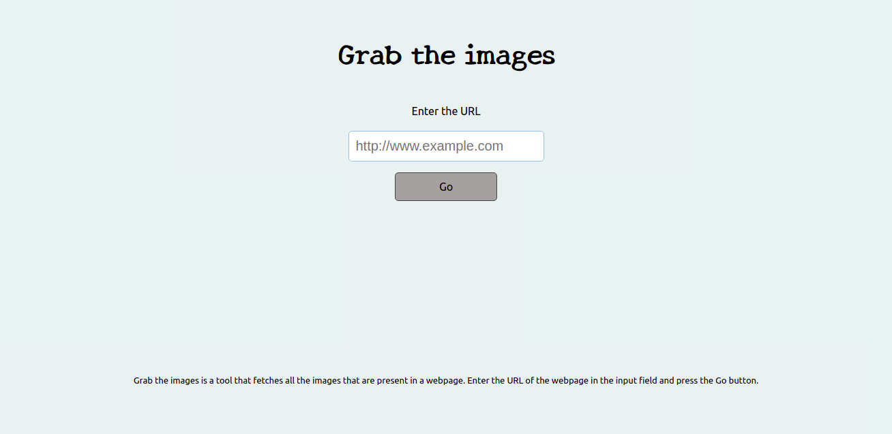
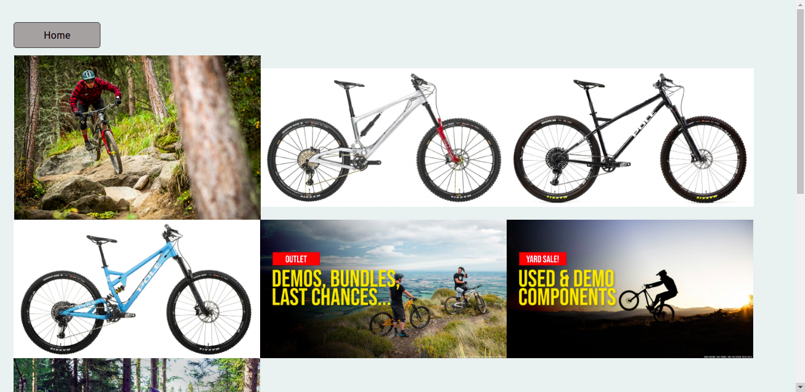
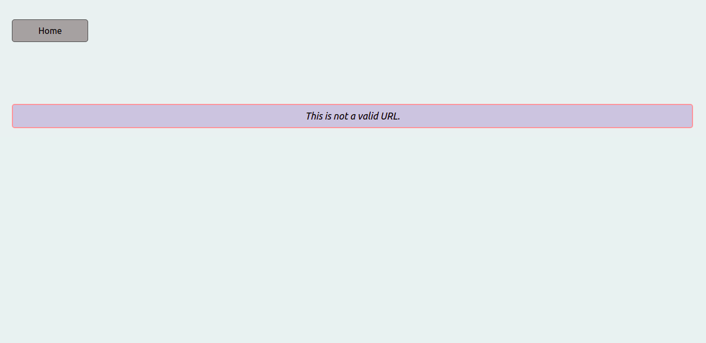
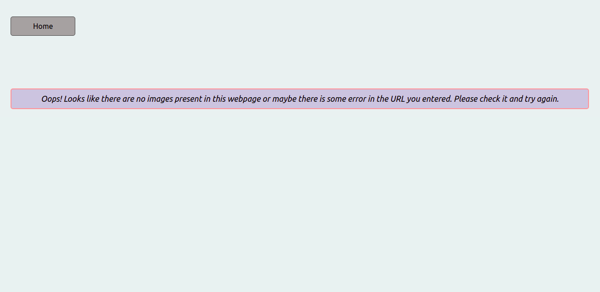

# Image Scraper

> Image Scraper is a web app that takes an URL of an website as an input, validates the URL and returns an array of URLs of the images used in that website.   
> It returns the appropriate error messages if the input URL is invalid, is empty or the website doesnot contain any images.   
> This is the frontend part of the app.
<div align="center">

[](https://github.com/praz99/image-scraper-frontend)
[](https://github.com/praz99/image-scraper-frontend/issues)
[](https://github.com/praz99/image-scraper-frontend/pulls)

</div>

## 📝 Contents

<p align="center">
<a href="#with">Built with</a>&nbsp;&nbsp;&nbsp;|&nbsp;&nbsp;&nbsp;
<a href="#ss">Screenshots</a>&nbsp;&nbsp;&nbsp;|&nbsp;&nbsp;&nbsp;
<a href="#features">Main Features</a>&nbsp;&nbsp;&nbsp;|&nbsp;&nbsp;&nbsp;
<a href="#gs">Getting started</a>&nbsp;&nbsp;&nbsp;|&nbsp;&nbsp;&nbsp;
<a href="#author">Author</a>&nbsp;&nbsp;&nbsp;|&nbsp;&nbsp;&nbsp;
</p>

## 🔧 Built with<a name = "with"></a>
- ReactJS
- HTML 5 and CSS 3

## API<a name= "backend"></a>

The backend API for this project created by me and can be found in [github](https://github.com/praz99/image-scraper-backend).

## Screenshots<a name = "ss"></a>
### Home


### Images (https://polebicycles.com)


### Message (Invalid URL)


### Message (Images Not Found)


## Main Features<a name = "features"></a>

- The app allows the users to enter an URL to the website.
- It validates the URL.
- Displays the appropriate messages for invalid or empty URLs.
- Displays the appropriate message if the input URL does not contain any images.
- Filters the null images URLs from the URL array.
- Displays all the images present in the given website.

## Getting Started <a name = "gs"></a>
This project was bootstrapped with [Create React App](https://github.com/facebook/create-react-app).

Make sure you have [Node](https://nodejs.org/en/), installed in your computer.   
Install [yarn](https://yarnpkg.com/getting-started/install). (or you can still use ```npm``` instead of ```yarn```.)

To get a local copy of the repository please run the following commands on your terminal:

```
$ git clone git@github.com:praz99/image-scraper-frontend.git
```
```
$ cd image-scraper-frontend
```

```
$ yarn install
```
```
$ yarn start
```

This runs the app in the development mode.
Open http://localhost:3000 to view it in the browser.

# Important
- This app and its backend API has not been deployed yet.   
- Before start using this app, please make sure you visit the [backend](https://github.com/praz99/image-scraper-backend) part of this project and follow the instructions given in the Readme file to have a running backend server.

## ✒️  Authors <a name = "author"></a>

👤 **Prajwal Thapa**

- Github: [praz99](https://github.com/praz99)
- Twitter: [@thapa_praz](https://twitter.com/thapa_praz)
- LinkedIn: [prazwal-thapa](https://linkedin.com/in/prazwal-thapa)
- Email: t.prazwal@gmail.com

## 🤝 Contributing

Contributions, issues and feature requests are welcome!

Feel free to check the [issues page](https://github.com/praz99/image-scraper-frontend/issues).


## 👍 Show your support

Give a ⭐️ if you like this project!

## 📝 License

This project is [MIT](./LICENSE) licensed.